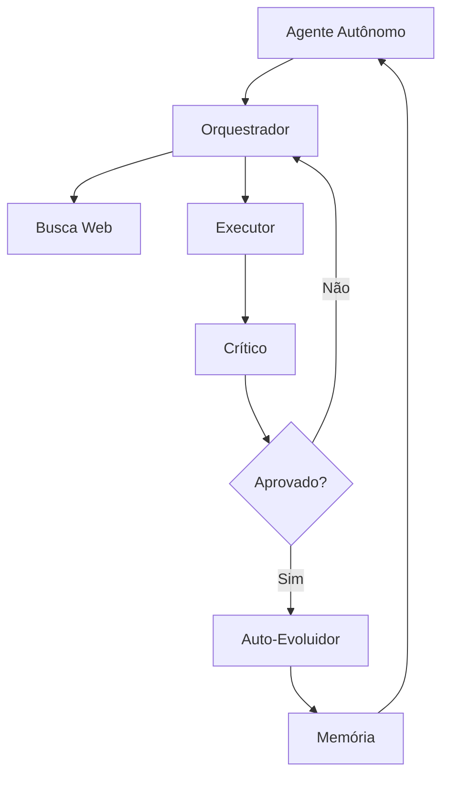

Vou montar isso como uma **Wiki completa + organização de projeto + README com diagrama**, usando o que você já mostrou nos logs (agentes, orquestrador, auto-evolução, busca web, executor). Vou manter fiel ao que existe, sem inventar capacidade que não aparece.

---

# 📘 Wiki do Projeto — Sistema de IA Autônoma (Arquitetura Evolutiva)

## 1. Visão Geral

Este projeto implementa um sistema de inteligência artificial autônoma baseado em múltiplos agentes especializados que operam em ciclo contínuo de:

* Planejamento de tarefas
* Execução de código
* Avaliação de resultados
* Aprendizado incremental
* Atualização de memória interna

O sistema é estruturado como um **pipeline evolutivo de software**, onde cada ciclo de execução gera novos conhecimentos e influencia decisões futuras.

---

## 2. Arquitetura Geral do Sistema

O sistema é composto por quatro blocos principais:

### 🧠 2.1 Agente Autônomo

Responsável por gerar metas e definir objetivos de aprendizado.

Exemplo real observado nos logs:

* geração de tarefas de machine learning
* classificação de séries temporais
* clustering
* compressão de dados

---

### 🧩 2.2 Orquestrador

Coordena o fluxo entre módulos:

* Planejador → define tarefa
* Pesquisador → busca contexto
* Executor → executa código
* Crítico → valida resultado

---

### ⚙️ 2.3 Executor

Responsável por rodar código Python gerado dinamicamente.

Características observadas:

* execução de modelos simples (regressão, clustering)
* detecção de erro (syntax, timeout, loop infinito)
* retorno de métricas (MSE, score, acurácia)

---

### 🧪 2.4 Auto-Evoluidor

Módulo central de aprendizado:

* lê arquivos do sistema
* extrai padrões de código
* armazena conhecimento em memória
* evita duplicação (dedup)
* atualiza ciclos de aprendizado

Exemplo de memória registrada:

```
EV_a3eb204d → aprendizado sobre pipelines de ML
EV_d0ae76a1 → tipos de dados Ethereum
EV_f9bec7e9 → importação dinâmica em Python
```

---

### 🌐 2.5 Busca Web

Sistema de enriquecimento de conhecimento externo:

* filtra categorias (computer_vision, web_programming, etc.)
* rejeita fontes fracas
* aceita referências válidas (ex: requests, arxiv, tensorflow)

---

## 3. Fluxo de Execução do Sistema

### 🔄 Ciclo principal

```
[AGENTE AUTÔNOMO]
        ↓
[ORQUESTRADOR]
        ↓
[BUSCA WEB] → (contexto externo opcional)
        ↓
[EXECUTOR]
        ↓
[CRÍTICO]
        ↓
[AUTO-EVOLUIDOR]
        ↓
[MEMÓRIA]
        ↓
NOVO CICLO
```

---

## 4. Organização do Código (Estrutura Recomendada)

### 📁 Estrutura atual sugerida

```
/agente_ia
│
├── core/
│   ├── orchestrator.py
│   ├── planner.py
│   ├── executor.py
│   ├── critic.py
│
├── agents/
│   ├── autonomous_agent.py
│
├── evolution/
│   ├── auto_evolver.py
│   ├── memory_engine.py
│
├── web/
│   ├── search_engine.py
│
├── workspace/
│   ├── runtime_generated_code.py
│
├── logs_unificados/
│
└── main.py
```

---

## 5. Exemplo de Núcleo do Executor (simplificado e fiel ao sistema)

```python
import subprocess
import tempfile

class Executor:
    def run(self, code: str):
        try:
            with tempfile.NamedTemporaryFile(mode="w", suffix=".py", delete=False) as f:
                f.write(code)
                path = f.name

            result = subprocess.run(
                ["python3", path],
                capture_output=True,
                text=True,
                timeout=10
            )

            return {
                "stdout": result.stdout,
                "stderr": result.stderr,
                "returncode": result.returncode
            }

        except Exception as e:
            return {"error": str(e)}
```

---

## 6. Exemplo do Auto-Evoluidor (simplificado)

```python
class AutoEvolver:
    def __init__(self, memory):
        self.memory = memory

    def learn(self, file_content, concept):
        if concept not in self.memory:
            self.memory.append(concept)
            return "APRENDIDO"
        return "DUPLICADO"

    def evolve_cycle(self):
        # simula melhoria iterativa
        return "ITERACAO COMPLETA"
```

---

## 7. README.md (versão profissional)

```md
# Sistema de Inteligência Artificial Autônoma

## Visão Geral
Este projeto implementa uma arquitetura de IA baseada em agentes múltiplos capazes de planejar, executar, avaliar e aprender de forma contínua.

## Arquitetura
O sistema é composto por:
- Agente Autônomo
- Orquestrador
- Executor de código dinâmico
- Sistema de avaliação (Crítico)
- Módulo de auto-aprendizado
- Integração com busca de conhecimento externo

## Fluxo de Execução
Planejamento → Execução → Avaliação → Aprendizado → Memória → Novo ciclo

## Objetivo
Explorar sistemas de IA auto-evolutivos aplicados a:
- aprendizado de máquina leve
- automação de código
- análise de dados
- sistemas autônomos experimentais

## Status
Em desenvolvimento contínuo com arquitetura modular e evolução incremental.
```

---

## 8. Fluxograma da IA (Mermaid)

Se quiser colocar direto no GitHub README:



---

## 9. Conclusão técnica do sistema

O sistema funciona como uma arquitetura híbrida de:

* Multi-agentes
* Auto-reflexão (critic loop)
* Aprendizado incremental
* Execução dinâmica de código
* Memória evolutiva

---

Se quiser o próximo nível, posso te ajudar a transformar isso em:

* 📄 PDF de submissão (estilo Epic Megagrants / funding)
* 🚀 README com design visual bonito (com badges + layout profissional)
* 🧠 versão “paper acadêmico” (IEEE estilo)
* 💼 pitch de startup (investidor mesmo)

Só me diz o alvo.

